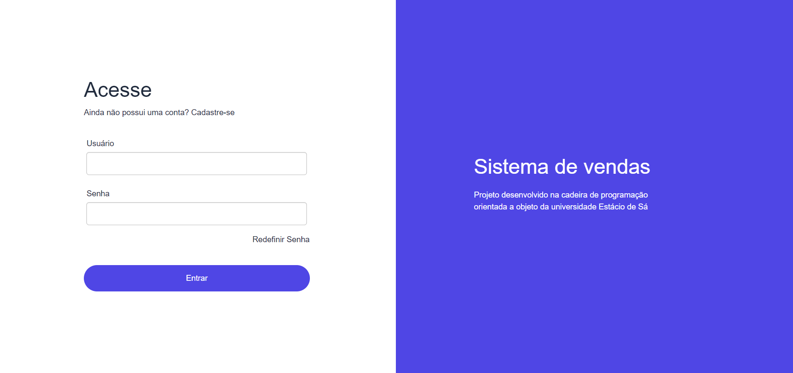
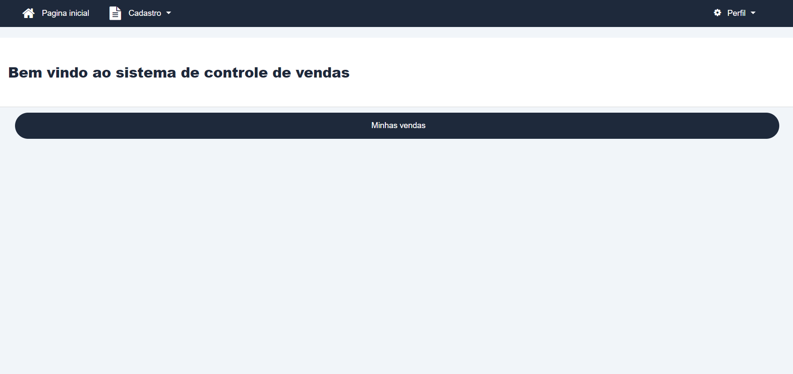
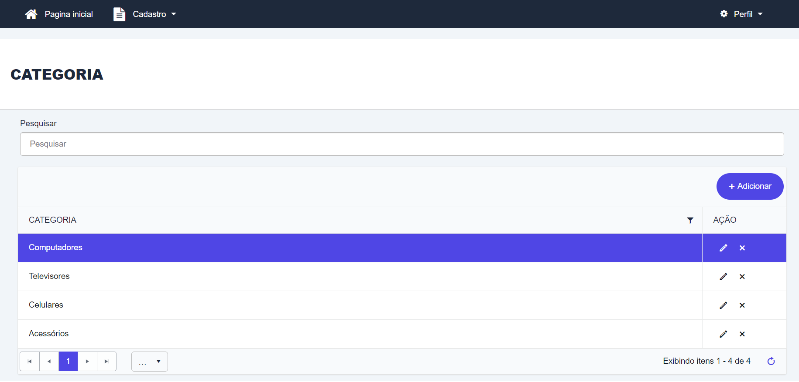
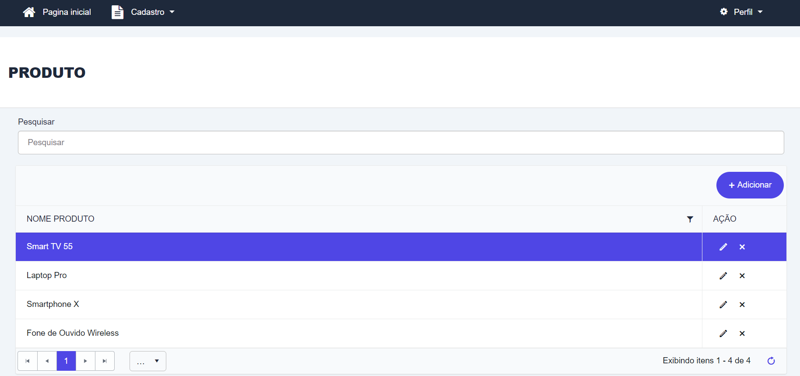
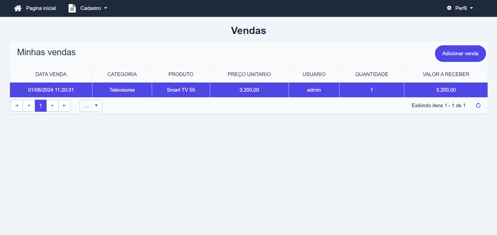
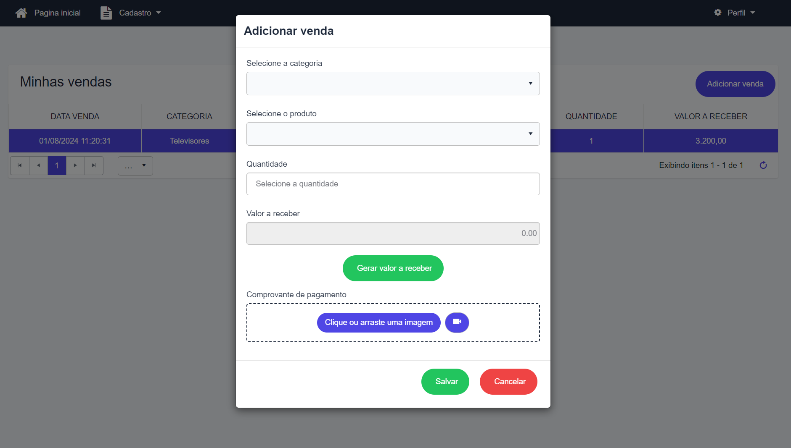

# Introdução

Projeto desenvolvido pela disciplina de Programação Orientada a Objetos em Java

## Pré-Requisitos

1. Spring boot

# Telas

1. Tela de login
 

2. Tela inicial

3. Tela cadastro de categoria

4. Tela cadastro de produto

5. Tela minhas vendas

6. Tela cadastro de vendas

